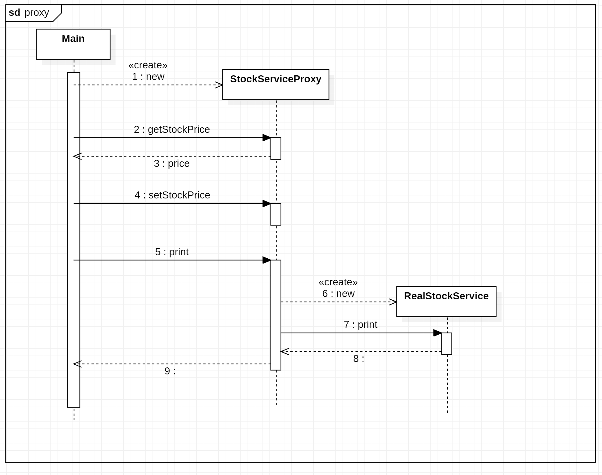

# Proxy 패턴

## Proxy 패턴 소개

- 어떤 객체를 사용할 때 객체를 직접적으로 참조하는 것이 아닌 해당 객체를 대리하는 객체인 프록시를 통해서 대상 객체에 접근하는 방식입니다.
- 대상 객체가 메모리에 존재하지 않더라도 기본 정보를 참조하거나 설정할 수 있으며, 필요한 시점에만 객체를 생성합니다.

### Proxy 패턴 사용 이유

- 프록시 객체를 통해 클라이언트의 모든 요청을 조절하면 서비스를 유연하게 제공할 수 있습니다.

### 장점

- 메모리 사용량이 큰 객체를 로딩하기 전에 프록시를 통해 참조할 수 있습니다.
- 원격 객체를 로컬에서 사용할 수 있습니다.
- 원본 객체에 접근하기 전에 사전 처리 작업을 수행할 수 있습니다.

### 단점

- 객체 생성에 추가 단계가 필요하므로 빈번한 객체 생성이 성능에 영향을 줄 수 있습니다.
- 코드 가독성이 저하될 수 있습니다.
---

## 스토리 : 주식 가격 데이터 처리
이 예제는 주식 가격을 가져오는 증권사의 프록시 패턴을 구현한 것입니다.
- 주식 가격 데이터는 외부 공급자로부터 가져오며, 이 작업은 시간이 오래 걸릴 수 있습니다. 
- 빠른 응답이 필요한 고객을 위해 Proxy 패턴을 사용하여 주식 가격 데이터를 효율적으로 처리합니다.

## Proxy 패턴 UML

- **StockService 인터페이스**
    - 주식 가격 데이터를 다루는 인터페이스입니다.
    - `getStockPrice()`: 주식 가격을 얻는 메소드.
    - `setStockPrice()`: 주식 가격을 설정하는 메소드.
    - `print()`: 주어진 문자열을 출력하는 메소드.
- **StockServiceProxy 클래스**
    - 대리자 역할을 하는 프록시 클래스로 StockService 인터페이스를 구현합니다.
    - 주식 가격을 설정하고 얻는 작업을 프록시가 대신 수행합니다.
    - `print()` 메소드는 프록시의 권한을 넘어서므로 `realService()` 메소드를 호출하여 본래 객체를 생성합니다.
    - `setStockPrice()`, `getStockPrice()`를 여러 번 호출해도 `Printer` 인스턴스는 생성되지 않습니다.
- **RealStockService 클래스**
    - 실제 주식 가격 데이터를 외부 공급자에서 가져오는 클래스입니다.
    - 주식 데이터를 외부 공급자로부터 가져오는 작업이 오래 걸리기 때문에 프록시를 사용합니다.

## Proxy 패턴 Sequence Diagram

1. Main에서 `StockServiceProxy` 클래스의 인스턴스를 생성합니다.
2. 주식 가격을 얻는 과정에서 인스턴스에 $130 주식 가격을 설정합니다.
3. 주식 가격을 반환합니다.
4. 주식 가격을 $160으로 설정하는 작업입니다.
    1. 이때 실제 `RealStockService`는 생성되지 않습니다.
5. `print()`를 호출합니다 
6. 실제 출력할 때만 `StockServiceProxy` 클래스가 `RealStockService` 클래스의 인스턴스를 생성합니다.
7. 실제 `RealStockService`에서 변경된 주식 가격을 받아와 출력하고, 다음 조회 때 변경된 가격을 제공합니다.
8. 결과값을 반환합니다.
---
## 결과

- 주식 가격을 설정하고 변경하는 작업은 프록시가 합니다. 
- 실제 주식 서비스는 출력할 때 생성되어 효율적으로 주식 가격 데이터를 처리할 수 있습니다.