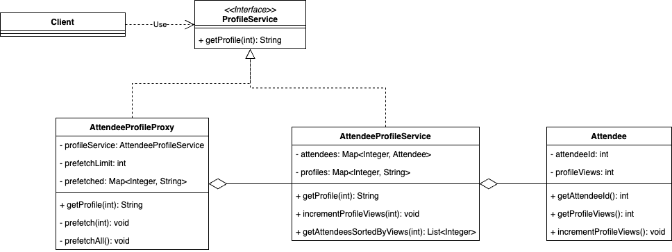

### 프록시 패턴을 사용하여 프로필 조회 구현
본인(대상; Subject)의 작업을 위임하여 실체에 대한 액세스를 줄이는 패턴

> 프록시 패턴은 실제 서비스에 대한 접근을 제어하고, 필요한 경우 추가 동작을 수행할 수 있게 해준다.

콘퍼런스 등록을 마친 참가자 중에는 다른 참가자 명단도 확인하고 싶은 이들이 있을 것이다.
원하는 사람을 명단에서 클릭하면 프로필 전체를 볼 수 있다.
전체 프로필을 처음부터 죄다 가져오는 것은 무리고 참가자 중 가장 접근 횟수가 많은 프로필만이라도 미리 가져오는 게 좋겠다.

프록시를 사용하여 프로필을 선취해서 응답성을 높이는 선취 프록시 예시를 구현했다.

( 어떤 사람 프로필을 선취하느냐 판별 기준: 프로필 클릭 수 )

```markdown
📦 [package proxyPattern]
   ├── Attendee.java : 참가자 정보를 저장하는 클래스
   ├── AttendeeProfileProxy.java : 프록시 (대리인)
   ├── AttendeeProfileService.java : 실제 프로필 서비스 (본인)
   ├── Client.java : 프록시 패턴(Proxy Pattern)을 활용하여 참가자 프로필을 조회하는 예제를 테스트하는 클래스
   └── ProfileService.java : 프록시와 실체가 구현하는 프로필 서비스 인터페이스

```


- 선취 프록시 클래스
    - 다음에 요청할 가능성이 큰 프로필을 미리 준비하는 일을 한다.
    - 실체 객체를 파라미터로 전달해 의존성을 주입할 수 있다.

프록시 클래스와 실체 클래스는 같은 인터페이스를 구현한다.
이렇게 하면 Main 클래스는 실제로 호출하는 곳이 프록시 클래스이든 실체 클래스이든 상관하지 않는다.
부모 타입이 항상 서브 타입을 대체할 수 있어야 한다는 Liskov substitution principle 에 따라 인터페이스를 공유 받으면 같은 클래스의 인스턴스로 취급을 받기 때문에 실체를 직접 이용해도, 중간에 프록시가 들어가도 문제없이 사용할 수 있다.